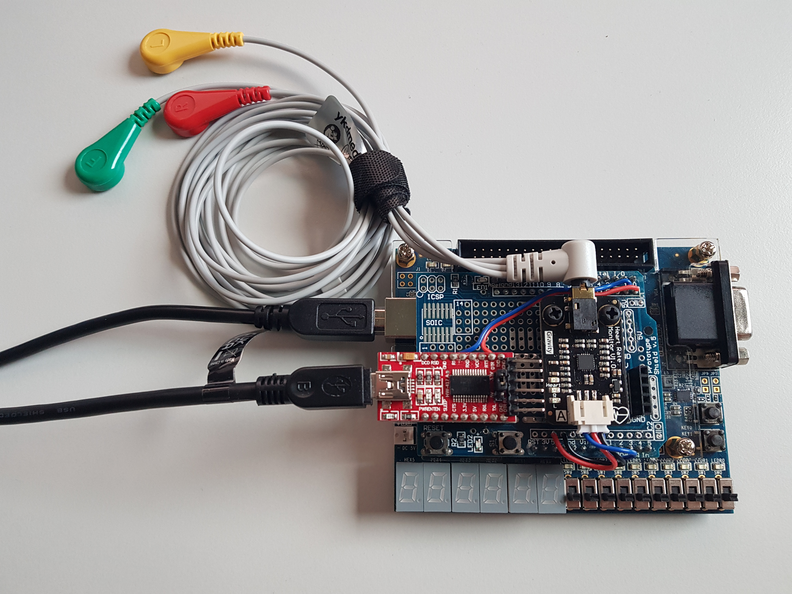
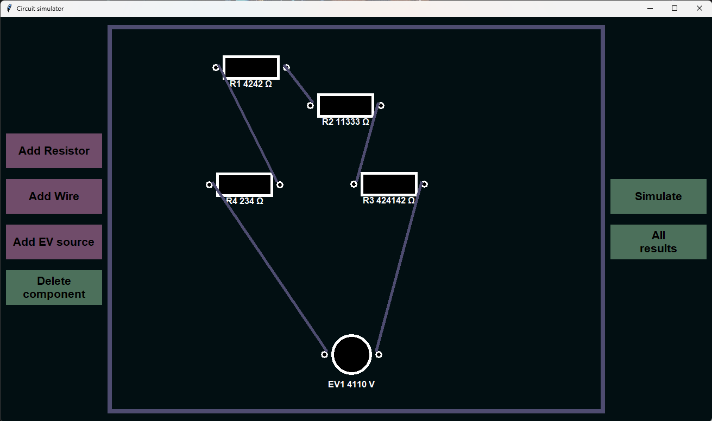
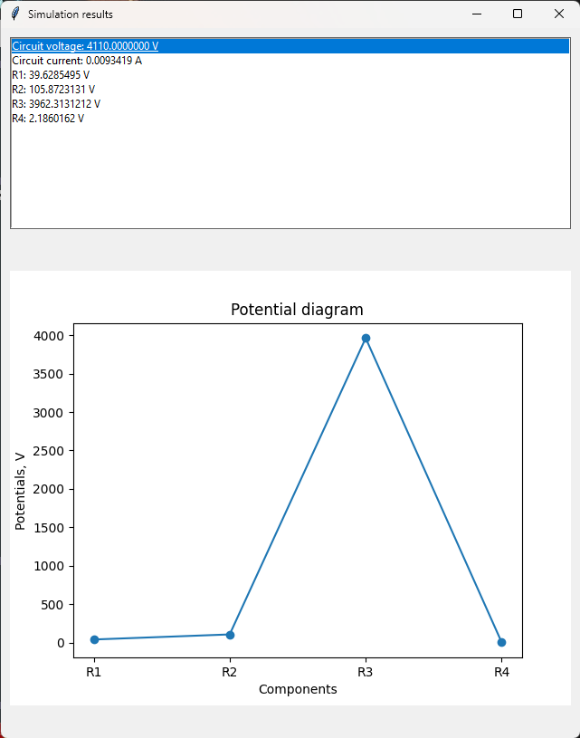
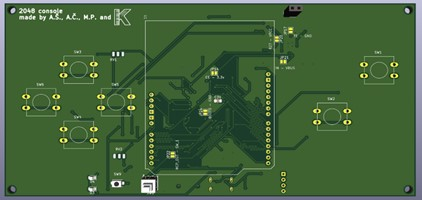
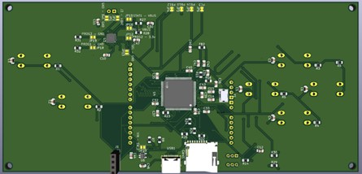
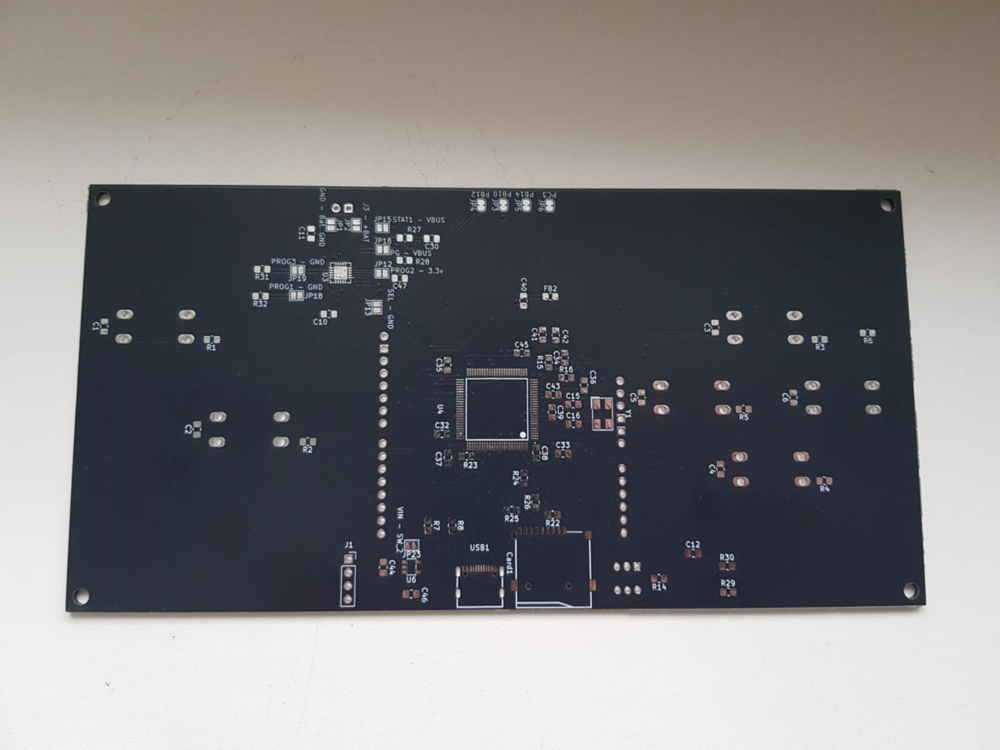
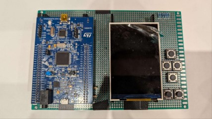
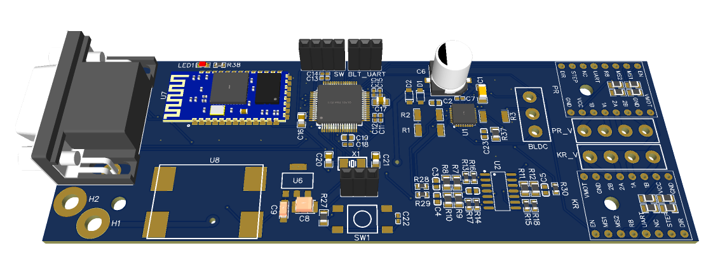
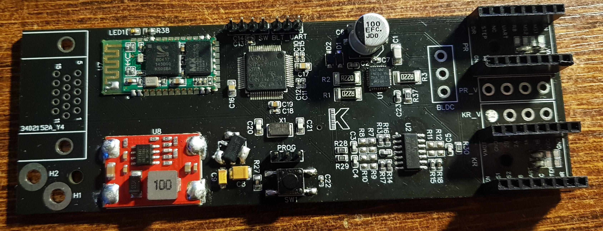
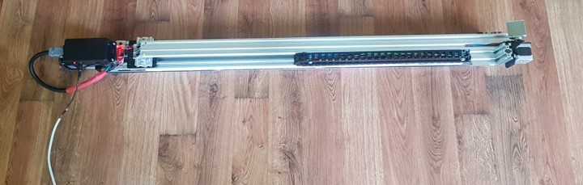

# Projects-Projektai
My past and current projects  
Mano užbaigti ir vykdomi asmeniniai projektai.

## EKG_Signalų_procesorius / ECG_signal_processor

*Įrenginio nuotrauka - Device photo*

*Mano elektrokardiograma - My electrocardiogram*

| Lietuviškai |  English   |
|-------------|------------|
| _Kompiuterių architektūros kursinis projektas. Sukurtas FPGA pagrįstas skaitemninis analoginio 3 laidų EKG signalo procesorius pagal Pan-Tompkins algoritmą. Prietaisas realiu laiku fiksuoja 3 laidų elektrokardiogramą, pateikia neapdorotus ir apdorotus signalų grafikų kompiuterio ekrane, o širdies ritmą atvaizduoja 7 segmentų ekrane FPGA devboard'e._ | _An FPGA-based digital processor for a 3-lead analog ECG signal was created using the Pan-Tompkins algorithm. The device records a 3-lead electrocardiogram in real time, displays both raw and processed signal graphs on a computer screen, and shows the heart rate on a 7-segment display of the FPGA development board._ |

*FPGA funkcinė architektūra - The functional architecture of the FPGA*

*Pan–Tompkins schema - Pan-Tompkins algorithm scheme*

---

## FEEGUUR_žaidimas / FEEGUUR_game

| Lietuviškai |  English   |
|-------------|------------|
| _Sukurtas Unity Android žaidimas. Žaidimo kodas parašytas C# kalba, bendra žaidimo skriptų kodo bazė ~10k eilučių. ,,FEEGUUR" pasiekiamas Google Play platformoje. Nuoroda: https://play.google.com/store/apps/details?id=com.Martersa.FEEGUUR_ | _A unity-based Android game was created. The game code is written in C#, with a total script codebase of around 10,000 lines. “FEEGUUR” is available on the Google Play platform. Link: https://play.google.com/store/apps/details?id=com.Martersa.FEEGUUR_ |

---

## Reflow_orkaitė / reflow_oven

| Lietuviškai |  English   |
|-------------|------------|
| _Per Wifi lokalų tinklą valdoma reflow orkaitė. Valdymas vyksta grafine vartotojo sąsaja prisijungus prie orkaitės per interneto naršyklę. Į okraitę galima įkelti temperatūrinę kreivę, kurią paleidus vykdymo komandą orkaitė atkartoja. Pagrindinis pritaikymas - SMD komponentų litavimas._ | _A reflow oven controlled via a local Wi-Fi network. Operation is managed through a graphical user interface by connecting to the oven with a web browser. A temperature profile can be uploaded to the oven, which it follows once the execution command is given. The main application is soldering SMD components._ |

---

## Python grafinis elektronikos grandinių simuliatorius / Python graphical electronic circuit simulator

| |  |
|--|--|

| Lietuviškai |  English   |
|-------------|------------|
| _„Elektroninių grandinių simuliatorius“ – tai programa, skirta pagrindinėms elektroninėms grandinėms tikrinti ir simuliuoti. Simuliatoriaus programa leidžia interaktyvioje naudotojo sąsajoje modeliuoti paprastas grandines, pridedant ir modifikuojant komponentus bei jų parametrus. Gali būti apskaičiuojami tokie parametrai kaip grandinės nuolatinė srovė ir komponentų įtampos. Pilnas projekto aprašymas: https://github.com/Ktadas/Kursinis_darbas_ | _‘Electronic circuit simulator’ refers to an application designed to test and simulate basic electronic circuits. The simulator program allows to model simple circuits in the interactive UI by adding and modifying the components and their parameters. Parameters such as: series current and component voltage can be calculated. Full project description: https://github.com/Ktadas/Kursinis_darbas_ |

---

## Žaidimų_konsolė / Game_console

| Lietuviškai |  English   |
|-------------|------------|
| _Kursinis projektas - STM32F407VGT6U pagrįsta retro žaidimų konsolė, su 320x480 RGB TFT ekranu, valdomu FSMC sąsaja. Šios sąsajos kontrolei bei ekrano valdymui sukurta asmeninė biblioteka. Realizuoti 2 žaidimai: 2048 bei raketos valdymo žaidimas. Projektas tęsiamas, suprojektuota PCB, komponentai paruošti surinkimui. Kiti projekto nariai: Anicetas Č., Aleksandras Š., Mindaugas P._ | _Course project – a retro game console based on the STM32F407VGT6U, with a 320x480 RGB TFT display controlled via the FSMC interface. A custom library was developed for handling this interface and managing the display. Two games were implemented: 2048 and a rocket control game. The project is ongoing: a PCB has been designed, and the components are prepared for assembly. Other project members: Anicetas Č., Aleksandras Š., Mindaugas P._ |

---

## Kameros_robotas_v2 / Camera_robot_v2

| Lietuviškai |  English   |
|-------------|------------|
| _2 Žingsinių valdiklių bei 1 BLCD variklio FOC kontroleris su bluetooth kontrole. Valdomas per android programėlę. Turi 2 ašis: pagrindinę linijinę bei antrą vertikalią. Trečioji horizontalioji su BLCD varikliu nebaigta, nes parinktas variklis neišvystė pakankamai galios, todėl reikia atnaujinti patį kontrolerį. Projektas vystomas, testuojami naujos BLDC valdymo mikroschemos._ | _A controller for 2 stepper motors and 1 BLDC motor with FOC control, featuring Bluetooth connectivity. Controlled via an Android application. It has 2 axes: the main linear axis and a secondary vertical axis. The third horizontal axis with the BLDC motor was not completed, as the selected motor did not provide sufficient power, therefore the controller itself needs to be updated. The project is ongoing, with new BLDC control chips currently being tested._ |

---

## MIDI_instrumentų_pedalas / MIDI_instrument_foot_controller

| Lietuviškai |  English   |
|-------------|------------|
| _Pedalas skirtas valdyti instrumentus arba programinę įrangą kaip ,,Ableton Live" įrašymo arba gyvo muzikos atlikmo tiklsu. Pedalas turi 5 mygtukus, kurie apšviesti RGB LED juostų, indikuojančių apie mygtuko būklę - svarbu valdant besikartojančius įrašus koncerto metu. Panaudotas 3 koncertuose._ | _A pedal designed to control instruments or software such as Ableton Live for recording or live music performance. The pedal has 5 buttons illuminated by RGB LED strips, which indicate the button’s state – an important feature when managing looping tracks during a concert. It has been used in 3 concerts._ |

---